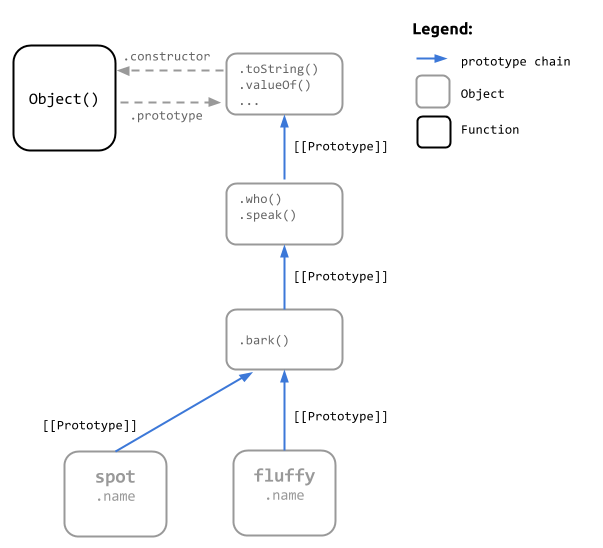

## Delegation using `Object.create()`
We used `Object.create()` above when creating the function prototypes. `Object.create()` does exactly what we really want - creating a linkage between objects by building an object based on another object.

So, maybe we can just use "plain objects", instead of constructor functions?

```
var foo = { a: 1 };

var bar = Object.create(foo);
bar.b = 2;

var baz = Object.create(bar);
baz.c = 3;

console.log("I can haz 'a' and 'b'? ", !!(baz.a && baz.b));
// true
```
`Object.create()` properly sets up the prototype linkage and gives us a new object; which we can then link to another object.  We don't have to worry about `instanceof` because we're not using functions as constructors; nor do we have to deal with setting a `.prototype` or `.constructor` property correctly.

So let's go back to our `Animal` and `Dog` example and see how we would compose that same functionality using delegation through `Object.create()` instead of constructors. 

We'll use `Object.assign()` to initialize the objects in the our chain. Most browsers don't support `Object.assign()` yet, so you can use this simple polyfill to run the examples:

```
if (!Object.prototype.assign) {
    Object.prototype.assign = function() {
        var args = [].slice.call(arguments),
            target = args.shift();
        
        return args.reduce(function(base, obj) {
            Object.keys(obj).forEach(function(prop) {
                if (obj.hasOwnProperty(prop)) {
                    base[prop] = obj[prop];
                }
            });
            return base;
        }, target);
    }
}
```

The functionality we want to compose using delegation will be similar to our original; but delegation is a fundamentally different approach and pattern than inheritance.

- Delegation builds functionality by composing (*via links*) regular objects, not by using constructor functions.
- Delegation uses more specific method names on the delegator objects that are reflective of the actions they perform. Inheritance keeps method names fairly generic, as sub-classes tend to re-implement specific behavior that override the base classes method. 
- State is typically maintained at the delegator level, not in the delegatee objects.

```
var Animal = {
    who: function() { return this.name; },
    speak: function(s) { console.log(this.who() + ": " + s); }
}

var Dog = Object.create(Animal, {
    bark: {
        value: function() { this.speak("woof!"); }
    }
});

var spot = Object.assign(Object.create(Dog), { name: "Spot" });
var fluffy = Object.assign(Object.create(Dog), { name: "Fluffy" });

spot.bark();
fluffy.bark();
```

That's much less code; and here's the new mental model you'll have to grok.  Much easier!



We're composing functionality here using `Object.create()`. And the `bark()` method of our `Dog` objects delegates to `Animal.speak()`, available via its prototype chain. 

The approach with the delegation pattern is to use an object as a base "type" that contains common behavior and have other objects link to that object to use that functionality. 

In many respects, what we're trying to do is simply *compose behavior*, not create types, like inheritance does.  The relationship between two objects is explicit via composition using `Object.create()`, rather than implicit via an internal inheritance mechanism.

So, if we're wanting to really just compose behavior; and those behaviors might be common to a number of different objects, there is actually another pattern we can use: **mixins**. 