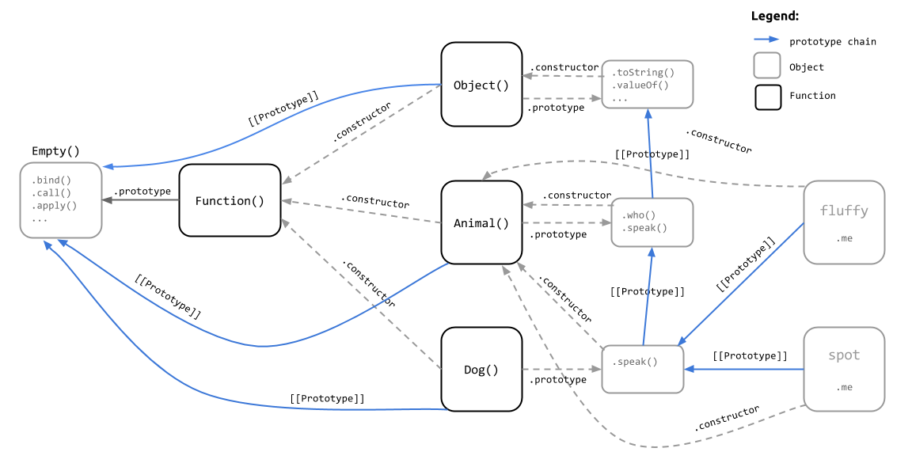

## Implementing inheritance in Javascript
So far we've seen that Javascript provides us with a number of "features" that make it *seem* as if it supports thinking about and implementing objects using classical inheritance. But, we've also seen the caveats that surround those features like `instanceof`, `new` to invoke functions as constructors and the `.constructor` and `.prototype` properties. 

To implement classical inheritance, we need to understand the details of how it's implemented behind the scenes to fully appreciate that Javascript isn't really using "classes" or inheritance at all.

Let's give it a go with a simple, albeit contrived, example of inheritance with a `Dog` which inherits from `Animal`.

```
// Our base "class" Animal
function Animal(name) {
    this.me = name;
}
// Some base "class" methods
Animal.prototype.who = function() {
    return "I am " + this.me;
};
Animal.prototype.speak = function() {
    // What should this do? I dunno...
    console.log("(Animal) speak!");
}

// A child "class" that "inherits" from Animal
function Dog(name) {
    Animal.call(this, name);
}
// Ensure we properly inherit from our base class
Dog.prototype = Object.create( Animal.prototype );
Dog.prototype.constructor = Dog;

// Add our own 'speak' method and call our base class 'speak' as well
Dog.prototype.speak = function() {
    Animal.prototype.speak.call(this); 
    console.log("Hello, " + this.who() + "." );
};

// Puppies! Awwwww
var fluffy = new Dog( "Fluffy" );
var spot = new Dog( "Spot" );
```
So, yeah, we now have a couple of talking dogs. Nothing to see here, move along...

Get a cup of coffee (*or your favorite beverage*) and sit down for second. Take some deep breaths; because as straight forward (*not so much*) as the above code looks, the following diagram shows what's actually happening under the hood:



Seems like we're going to a lot of effort to treat Javascript like it has classes by 

- using `new` to invoke functions as constructors
- mimicking methods by assigning them to the function's `.prototype` property
- ensuring that we create the proper relationships by setting the correct prototype for child classes and ensuring we call our parent class's constructor in the right context
- and re-wiring the `.constructor` property of our `.prototype` to ensure it points to our actual constructor function

In fact, this all boils down to jumping through hoops to basically ensure our objects properly compose behavior via creating the right linkage to another object via composition in the prototype chain.

I hear you asking, "*There must be a better, more idiomatic, way to do this in Javascript?*" 

Yes, there is.