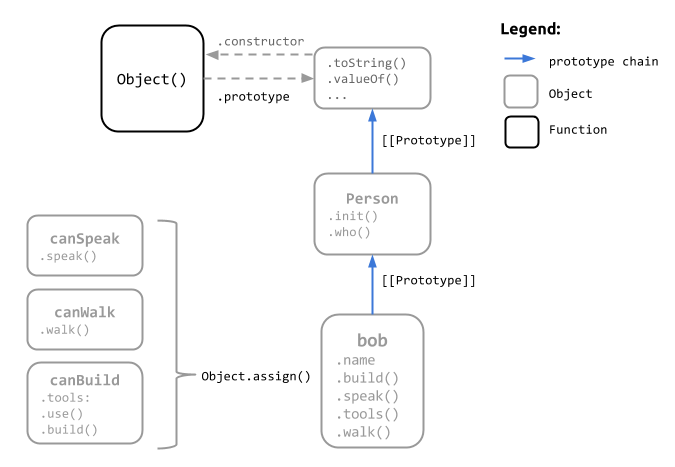

In this section, we're going to focus on the following:

- how Javascript's prototype based objects work
- building up functionality through *pseudo-classical inheritance* via constructor functions and the prototype chain
- and a simpler, more idiomatic way to build up functionality using composition, delegation and mixins.


### Composing Behavior through Mixins
The concept of *mixins* is fairly wide spread and found in a number of languages.  The idea is to factor out common, reusable behavior into their own objects and then integrate those objects into more specific objects that need to use them.

```
// A base object so we can create people
var Person = {
    who: function(){ return this.name; },
    init: function(name) {
        this.name = name;
    }
};

// Factor out common functionality into their own
// objects
var canSpeak = {
    speak: function(s) { console.log(this.who() + ": " + s); }
};
var canWalk = {
    walk: function() { console.log(this.who() + " is walking..."); }
};
var canBuild = {
    tools: ['hammer', 'pliers'],
    use: function(tool) { this.tools.push(tool); },
    build: function(thing) { 
        var withTool = parseInt(Math.round(Math.random() * this.tools.length));
        console.log(this.who() + " is building a " + thing + " using " + this.tools[withTool]);
    }
};

// Can we build it?...
var bob = Object.assign(Object.create(Person), canSpeak, canWalk, canBuild);
bob.init("Bob the Builder");
bob.speak("Hi there!");
bob.walk();
bob.use("stapler");
bob.build("web site");
```
This pattern improves things by 

- further simplifying the mental model used to create objects, 
- improves the readability of the code,
- makes it very easy to isolate functionality in specific objects for better reuse. (*DRY, Separation of Concerns*)  

Here's the inside view of using mixins.



What an object can do is explicitly stated through the use of mixins. Plus, we can add as many behaviors/mixins as make sense to an object.

We're still using delegation here, via the prototype chain; but mixins give us the ability to inherit from objects in a different way.  Mixins represent *concatenative inheritance*, meaning that instead of delegating behavior to another object, we copy that behavior directly. You can see this in the above diagram, as all the mixins' properties now exist on our new object.

## Summary
There are many libraries available that wrap the implementation of *inheritance* making it easier to program in Javascript if you come from a strict OO background or "class" centric language. But using inheritance and trying to maintain that mental model in Javascript is complex and hard to manage due to various problems.

With the end goal of simply being able to compose functionality, we found that the more idiomatic way to do that in Javascript is through simple objects, the prototype chain, and using new patterns of thinking in our design like *delegation* and *mixins*.

 
