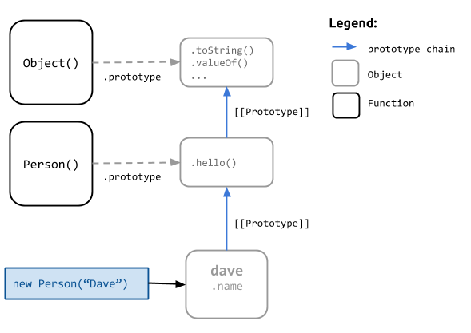

## What is this `prototype` thing?

When most developers think of Object Oriented (OO) programming, they are usually coming from languages like Java and C++ where the concept of a *class* represents a kind of *blueprint* for a particular type of object's behavior. In those languages, a class is a separate, (*typically*) static representation of how an object should be created; and this is much different than an *instance* of an object created from that class.

Despite what some people might tell you, Javascript does not have classes.  What some developers refer to as a "class", is actually just a function, with other functions assigned to its `.prototype` property; which, in turn, is called with `new` in order to treat the function like a constructor.

```
// Not a 'class', just a function
function Person(name) {
  this.name = name;
}
Person.prototype.hello = function() {
  console.log("Hello, my name is " + this.name);
};

// invoke our function with `new` for magical constructor behavior
var dave = new Person("Dave");
dave.hello();
// "Hello, my name is Dave"
```

The `.prototype` property of `Person` above is an actual property on the `Person` function (*functions are objects*). This property is treated as an object and used to create the actual prototype to which our new object is linked.  

**Note**: In some browsers you can access an objects prototype using `__proto__` property - typically referred to using the `[[Prototype]]` symbol. 

> The actual prototype of an object "*is just another object*" to which it is linked

Using the `.prototype` property of a function we can assign new properties so that when a new object is created from that constructor function, those properties are available on that object's actual prototype.  

To wit, the above code snippet yields the following relationships:



These prototypes in Javascript are really just a way to compose functionality. They allow an object to *delegate* behavior to its *prototype*, which is simply just another object that it links to via an internal, single path chain.  

This resembles "inheritance" in the sense that you can call a function on your object that isn't directly defined on that object, so long as it is defined on an object that your function links to in the prototype chain. 

You may have heard this referred to as *prototypal inheritance*; but, in reality, this is simply Ojects Linking to Other Objects (*OLOO*), as [Kyle Simpson](http://davidwalsh.name/javascript-objects-deconstruction) correctly termed it. The actual work is being accomplished via:

- **composition** - your object contains another object, called its prototype, and
- **delegation** - when you access a property on your object, if it's not directly defined on it, javascript will search the prototype chain and delegate that behavior to the first object it finds that defines that property.

### `.constructor` 
Just to make OO concepts even muddier in Javascript, we also have the `.constructor` property. This property will reference a function used to create one of the objects in a given object's prototype chain. 

When you call a function with `new` the `.constructor` property is set for you on the returned object's prototype.

In the case of our example above, we can inspect the `.constructor` property and see that it holds a reference to the `Person()` function, which we used to construct the object. 

```
dave.__proto__.constructor; // function Person() 
dave.__proto__.__proto__.constructor; // function Object()
```


However, this direct relationship doesn't always hold true; especially when we start trying to implement *inheritance* using `new` and assigning prototypes. 

```
function Foo(){}

function Bar(){
    // Call our parent constructor on our object
    Foo.call(this);
}
// "inherit" from Foo's prototype
Bar.prototype = Object.create(Foo.prototype);

var bar = new Bar();

console.log(bar.constructor);
// function Foo() !WOOPS, that's not our constructor
```
By re-assigning the prototype, we end up with the `.constructor` property of the prototype object referencing `Foo()`, not the constructor of our `bar` object, which we expected to be `Bar()`. To fix that, we have to manually reassign the constructor right after setting its prototype.

```
Bar.prototype = Object.create(Foo.prototype);
Bar.prototype.constructor = Bar;
```

### `instanceof`
When using `new` for constructor functions, Javascript allows us to use `instanceof` to check if an object is an instance of a particular constructor function.  More precisely, `instanceof` checks if an object's prototype chain contains an instance of a given constructor's prototype.

For example:
```
function A(){}

function B(){}
B.prototype = Object.create(A.prototype);

var obj = new B();
console.log(obj instanceof B); // true
console.log(obj instanceof A); // true
console.log(obj instanceof Object);  // true
console.log("%o", obj.constructor.prototype); // A {}
```
However, `instanceof` can be problematic in some circumstances and return incorrect results:

- the prototype of the object in question has changed
- you are comparing across frame/window execution contexts (*object from one frame, say an Array, checked in another frame will return false when doing `obj instanceof Array`*)
- you don't have a constructor function to use to introspect the object (*say, a third party library, module or closure*)

For instance:
```
// Related objects whose constructors are out of scope
var a = (function(){
    function A(){};
    return new A();
})();
var b = (function(proto) {
    function B(){};
    B.prototype = proto;
    return new B();
})(a);

// Can we determine if b is related to a?
function F(){}
F.prototype = a;
console.log("Related? ", b instanceof F);
// Related? true
```
In this case, we have two objects whose constructor functions weren't available for comparison using `instanceof`; so we create a throw-away function and assign the base object `a` to it's `.prototype` and then use `instanceof` to determine if `b` is an instance of the function `F()`. Rather, if the prototype of `F()` is anywhere in the prototype chain of `b`.

Clearly the object `b` was not constructed by the function `F`, but we still get a false positive because of how `instanceof` tests for ancestry using the constructor's prototype.

> `obj instanceof F` is semantically misleading. It does not imply that `obj` was created by `F()` or is even remotely related to `F()`; only that the prototype `F` will use when invoked with `new` is somewhere in the prototype chain of `obj`.